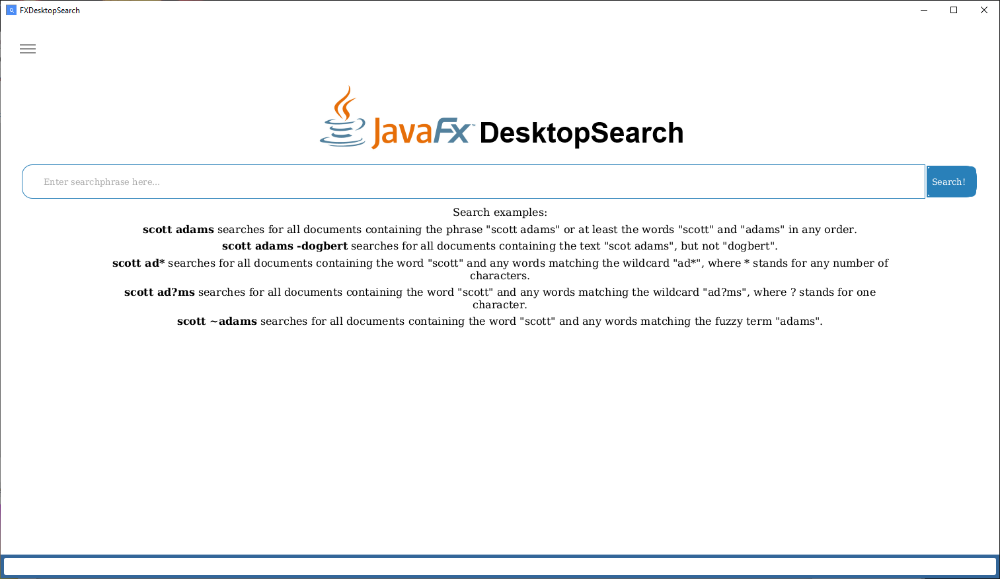
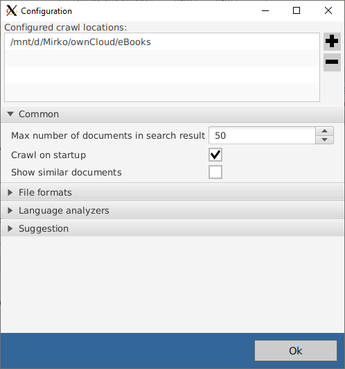
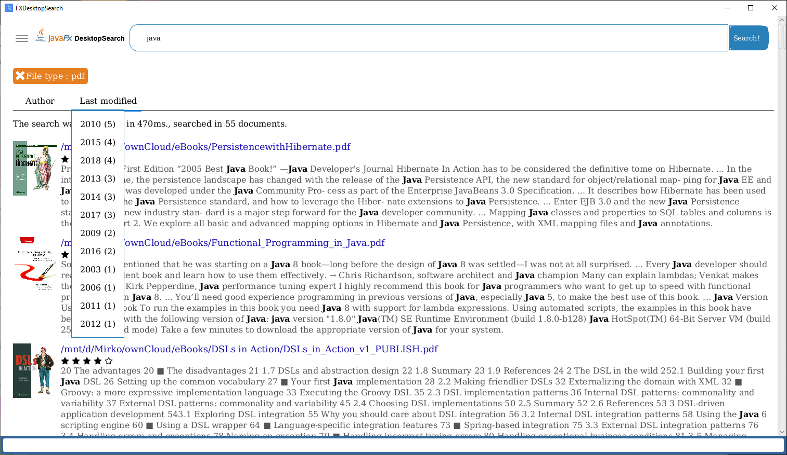

FXDesktopSearch - The free search application for your desktop
==============================================================

FXDesktopSearch is a Java and JavaFX based Desktop Search Application. It crawls a configured set of directories and 
allows you to do fulltext search with different languages support on the content.

During the fulltext search, you can do drilldown queries on the found documents to restrict search results by date, 
author, document type or language. Beside the fulltext search analysis, advanced natural language processing is done.
This extracts known entities such as persons, locations or organizations from the text and makes them available
for drill-down facetted search.

FXDesktopSearch can crawl the local and remote filesystems. It also watches already crawled files for changes, so once a file is indexed and changed on the filesystem, the index is automatically updated.

 

Download
--------

Releases are available [at GitHub](https://github.com/mirkosertic/FXDesktopSearch/releases) or

Installation
------------

Windows
-------

Installation on Windows systems is quite easy. Download the .exe installer and execute it with administrator permissions. This will install FXDesktopSearch and the required Java runtime on your machine.

Starting with Windows 10, you can also install FXDesktopSearch from Microsoft App Store.

Linux
-----

Installation on Unix systems is also easy. Just download the .rpm file and execute it using one of the the following commands according to your Linux distribution type:

Packaging method                 | How to install using the shell                                       
---------------------------------|-----------------------------------------------------
RedHat Package Manager           | sudo rpm -i downloadedrpmfile.rpm
Yum                              | sudo yum install downloadedrpmfile.rpm
Debian                           | either use the provided .deb file or use "apt-get install alien" to install the alien package converter. Then use "alien --to-deb --keep-version <downloadedrpmfile>" to convert the rpm to a deb file. Finally use "sudo dpkg --install createddebfilefromalien.deb" to install the file.

Usage
-----

The following start screen is shown after you start the application:

After the first launch, you have configure the crawl locations and some other settings. This configuration can be done by clicking on Hamburger Menu -> Configure.

Configuration
-------------

The configuration screen is triggered by using Hamburger Menu -> Configure. The following dialog will appear:

The following options are available:

Option                                         | Description                                       
-----------------------------------------------|-------------------------------------------
Show similar search results                    | Can be enabled if you want to include similar search results for every match. Please not that this is very processing insensitive.
Limit search results to                        | This is the number of search results presented to the user.
Number of suggestions                          | This is the number of search phrase suggestions. They are shown as soon as you start to type words into the query text field.
Number of words before suggestion span         | Include this number of words in the search phrase suggestion before a matching word
Number of words after suggestion span          | Include this number of words in the search phrase suggestion after the last match
Slop for suggestion spans                      | Allow this number of words between entered words for matching search phrase suggestions
Require suggestions to be in order             | If enabled, suggestions are only shown for the exact order by query terms.
Indexed directories                            | This is the list of directories to crawl and index
Scanned documents                              | Check every document type you want to index
Language analyzers                             | Advanced: enable or disable language specific analyzers.

Doing some search
-----------------

After you have configured the application, crawling starts automatically a few seconds after application start. When crawling is completed, the index can be updated by clicking on Hamburger Menu -> Perform complete crawl (this option will be grayed out while crawling). Now FXDesktopSearch will scan the configured paths and add the file to the index. You can see the indexing progress in the status bar of the application.

After the crawl is finished, you can start to search documents. The following search screen will be shown. Now you can enter a search phrase and click the magnifier icon. A search result as follows will be displayed:

You can click on the facets on the top of the search result to further restrict(drilldown) your search result. You can also click on file names to open the files using the assigned application. FXDesktopSearch also detects similar or duplicate files, too! These files are listed in a green color below the filename. There is also some highlighted text to show what was the best matching text snippet of your search.

FXDesktopSearch gives for every found document a star rating. Five stars mean this is a very good match. Zero stars mean that the match was not very good, but there was still a match.

Search suggestions
------------------

While typing a search phrase, FXDesktopSearch tries to suggest search phrases you might also want to consider. The following screenshot shows an example of this functionality:

The search suggestion is restricted or modified while you are typing. Please not that at least three characters must be entered per single word of your search phrase to enable search suggestions.

Under the hood
--------------

FXDesktopSearch has a hybrid JavaFX2/HTML5 user interface. This means that the UI is basically a JavaFX scene with an embedded JavaFX WebView. The WebView renders a HTML page,
which is delivered by an embedded Jetty WebServer. Using HTML allows us to generate and style complex user interfaces without creating new JavaFX controls.

Under the hood FXDesktopSearch uses Apache Lucene to build the fulltext index for the crawled documents. It also uses Apache Tika for content and metadata extraction.

The FileCrawler reads from a parallel Java 8 stream of files and passes them to the ContentExtractor. 
The ContentExtractor extracts the content and the metadata and passes the result to the LuceneIndexHandler which uses the Lucene Near-Realtime-Search Feature(NRT). The LuceneIndexHandler writes or updates the file in the Lucene index and also generates the search facets for later drilldown queries.

Modified files are tracked by the Java NIO WatchService API. Every file modification is send to the ContentExtractor and the final results are also updated by the LuceneIndexHandler in the fulltext index.

The embedded webserver is available by opening http://127.0.0.1:4711/search
